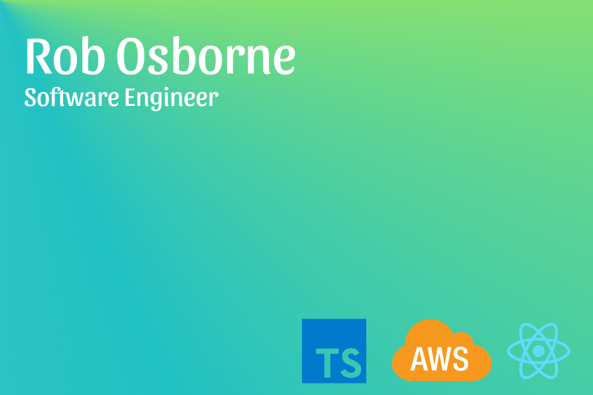

    &nbsp;&nbsp;
    &nbsp;&nbsp;
    &nbsp;&nbsp;
    

 

## 👨🏻‍💻 About Me

- 🔭 I’m currently working on aws architect associate certification.
- 🌱 I’m currently learning Unity, TypeScript and AWS.
- 👯 I’m looking to collaborate on TypeScript and Unity projects.
- 😄 Pronouns: He/His.
- ⚡ Fun fact: I am a twin.

 

## 💻 Tech

### Languages/Frameworks

### Tools

### Databases 

### CI

### Gaming

 
 

## 📜 My Certifications

- [AWS Certified Developer – Associate](https://www.youracclaim.com/badges/1f70f1af-95f8-4934-b5b5-dd4e197b2bbc/public_url)

 

## 🗠 Stats

| | | 
|:-------------------------:|:-------------------------:|
| | |
